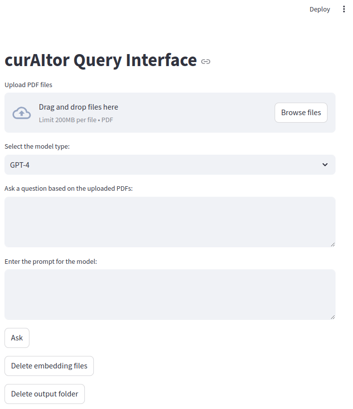

# LLMs for Data Extraction

[](https://curaitor.readthedocs.io/en/latest/)
[](https://github.com/mmore500/curaitor/actions/workflows/ci/)
[](https://github.com/mmore500/curaitor)

Schmidt OxRSE 2024 Project

-   Free software: MIT license
-   Documentation: [Read the Docs](https://curaitor.readthedocs.io/en/latest/)

## Set Up Development Environment

```bash
git clone https://github.com/mmore500/curaitor.git
python3 -m venv env
source env/bin/activate
python3 -m pip install -r curaitor/requirements-dev.txt
```

For conda environment (linux):
```
conda env create -f curaitor_linux_env.yml
```

We recommend using Python 3.11.
If you have Python 3.11 installed, but it is not your default Python version you can use "`python3.11`" instead of "`python3`" above. 
General guidance on managing multiple Python versions can be found [here](https://realpython.com/intro-to-pyenv/).

### Download OpenScience PDFs (OSF) with your username, token and project ID:**

   i. username is usually the email during registration.

   ii. token could be generated from your profile in the OSF and could be passed as environmental variables using
   `export OSF_TOKEN='YOUR TOKEN STRING'`. 

   iii. project ID is the 5-character alphanumeric key after your project's url, e.g., `osf.io/4zmdh`, (see the [OSFClient](https://osfclient.readthedocs.io/en/latest/cli-usage.html) documentation).

## Set Up Ollama (for using open-source LLMs such as Llama 3)

1. **Download Ollama:**
   i. For Windows: <https://ollama.com/download/windows>
   ii. For Linux: <https://ollama.com/download/linux>
   iii. For Windows: <https://ollama.com/download/mac>

   Then follow the corresponding instructions for installation on each platform.

2. **Download open-source LLM and text embedding model compatible with Ollama:**
   i. Type `ollama pull llama3` (for Llama 3 8b model) on terminal
   ii. Type `ollama pull nomic-embed-text` (for nomic text embeddings) on terminal

## How to Run the Streamlit User Interface

To launch the Streamlit user interface for this project, follow these steps:

1. **Ensure you have Streamlit installed.** You can install it using pip if you haven't already:

    ```sh
    pip install streamlit
    ```

2. **Run the Streamlit application** by executing the following command in your terminal:

    ```sh
    streamlit run script/curaitor.py
    ```

This will start the Streamlit server and open the user interface in your default web browser.




## Contribution Guidelines

1. Open pull request.
2. Ensure tests, styling, and linting pass locally.
   ```bash
   ./test.sh
   ./style.sh
   ./lint.sh
   ``` 
3. Ensure tests, styling, and linting pass in CI.
4. Request code review.
5. Merge.

## Credits

This package was created with [Cookiecutter](https://github.com/audreyr/cookiecutter).
